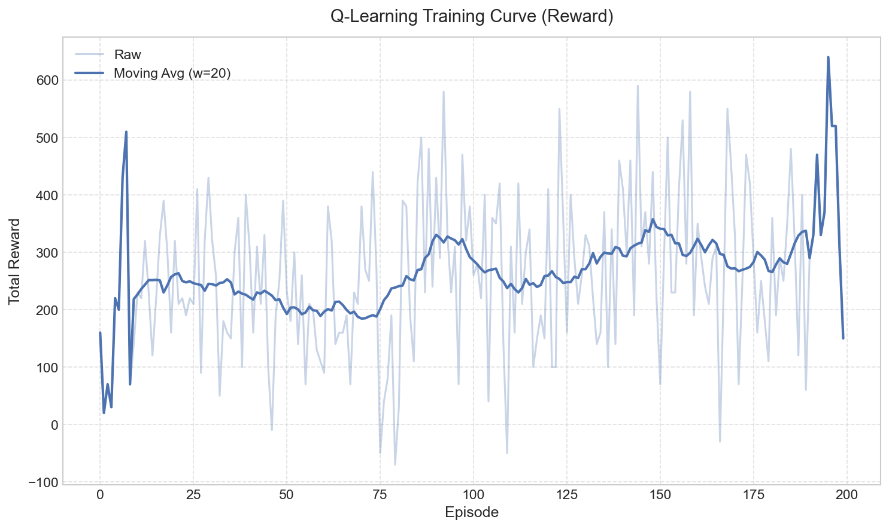
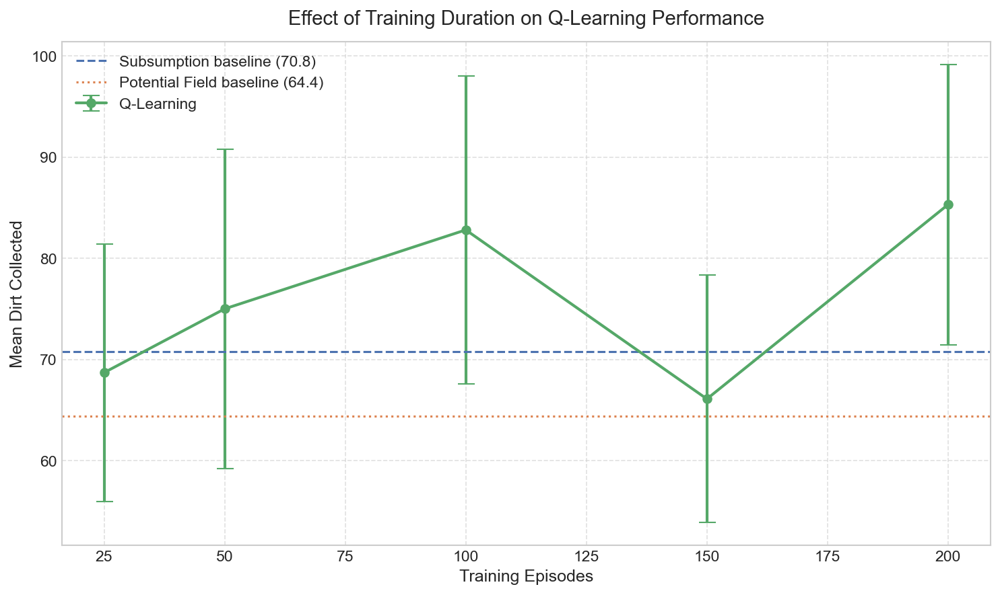

# COMP4125 Coursework - 机器人吸尘器仿真

基于 COMP4125 实践课提供的机器人吸尘器代码，扩展为多机器人自主智能体仿真系统。多个机器人在 2D 环绕边界（toroidal）环境中自主运行，执行清洁任务，同时管理电量、规避障碍物和猫、与其他机器人协调。

## 快速开始

```bash
# 需要 Python 3.9+（GUI 依赖 tkinter）

# 安装依赖
pip install -r requirements.txt

# 启动 GUI 仿真(⭐️)
python main.py

# 无 GUI 模式运行（用于自动化实验）
# python run_headless.py --seed 42 --frames 3000

# 运行测试
# python -m unittest -v
```

> **注意**：本项目核心仅依赖 Python 标准库（`tkinter`、`math`、`logging` 等），无需额外第三方库即可运行仿真。`requirements.txt` 中列出的是实验阶段用于数据分析和可视化的依赖。

## 项目结构

```
main.py                  # 程序入口
run_headless.py          # 无 GUI 模式，用于自动化实验
app/
  bootstrap.py           # 应用装配（UI + 仿真连接）
  context.py             # 初始仿真状态创建
  logging_config.py      # 双通道日志（文件 + 控制台）
simulation/
  astar.py               # A* 寻路算法
  counting.py            # 垃圾收集计数器
  engine.py              # 主仿真循环、暂停、重置
  factory.py             # 实体创建 / 删除 / 重置
  runtime.py             # 仿真运行时全局状态
  state.py               # 状态对象定义
  stats.py               # 统计数据计算
  passive_index.py       # 被动对象空间索引
robot/
  bot.py                 # 机器人实体（编排各子系统）
  brain.py               # 决策逻辑（Subsumption 架构）
  brain_potential_field.py # 人工势场法决策逻辑 [研究问题1]
  brain_qlearning.py     # Q-Learning 决策逻辑 [研究问题1]
  sensing.py             # 传感器计算（灯光、机器人、杂物、猫、充电站）
  motion.py              # 差速驱动运动学 & 边界环绕
  cleaning.py            # 垃圾收集逻辑
  state_view.py          # 模式推导（用于日志）
entities/
  cat.py                 # 猫实体（带 panic-jump 行为的障碍物）
  charger.py             # 充电站实体
  dirt.py                # 垃圾 / 碎片实体（多种类型）
  lamp.py                # 灯实体（光源）
ui/
  window.py              # 画布初始化
  renderer.py            # 集中实体渲染
  controls.py            # 速度滑块、日志级别下拉框
  control_panel.py       # 增删实体按钮面板
  stats_panel.py         # 统计显示面板
  theme.py               # 颜色 / 样式常量
  tooltip.py             # 工具提示组件
experiments/                  # [研究问题1] 实验框架
  train_qlearning.py     # Q-Learning 训练脚本
  run_experiments.py     # 批量对比实验 runner
  run_generalization.py  # 泛化测试
  analyze_results.py     # 统计分析 & 图表生成
  qtables/               # 训练好的 Q-table
  results/               # 实验 CSV 数据
  figures/               # 生成的分析图表
tests/
  test_regressions.py    # 61 个回归测试
docs/
  CHANGES.md                 # 变更记录总览
  architecture-overview.md   # 模块架构说明
  bugfixes.md                # Bug 修复记录
  new-features.md            # 新增功能说明
```

## 使用的 AI 技术

### 1. Subsumption 架构（机器人决策）

机器人大脑（`robot/brain.py`）实现了基于优先级的 subsumption（包容式）架构，高优先级行为会抑制低优先级行为：

| 优先级 | 行为 | 触发条件 |
|--------|------|----------|
| 1（最高） | 重叠分离 | 机器人间信号 > 20000 |
| 2 | 低电量充电 | 电量 < 600，使用 A* 导航 |
| 3 | 猫冻结（紧急停车） | 猫信号 > 3000 |
| 4 | 猫回避（转向躲避） | 猫信号 > 700 |
| 5 | 碎片回避 | 碎片信号 > 5000 |
| 6 | 机器人回避 | 机器人信号 > 3000 |
| 7（最低） | 随机漫游 | 默认探索行为 |

### 2. A* 寻路算法（充电导航）

当电量低于阈值时，机器人使用 A* 搜索（`simulation/astar.py`）规划前往最近可用充电站的路径：
- 基于网格的世界寻路
- 障碍物分类（大块碎片不可通行，小垃圾可穿越）
- 路径被阻断或发现更优充电站时动态重规划
- 多充电站评估，考虑竞争者数量

### 3. 反应式猫回避（双边策略）

机器人与猫之间的双向回避系统：
- **机器人侧**：近距离传感器检测猫，大脑控制转向躲避
- **猫侧**：可配置距离内触发 panic-jump（惊跳远离）
- **引擎层安全网**：基于物理距离的冻结机制，即使传感器盲区也能防止碰撞

## 相对原始代码的主要改进

本项目基于课堂提供的单文件机器人仿真进行扩展，主要改动：

- [**模块化架构**](docs/architecture-overview.md)：从约 1200 行的单体文件重构为 37 个职责明确的模块
- [**25 项 Bug 修复**](docs/bugfixes.md)：涵盖 A* 寻路、充电系统、运动物理、实体管理
- [**9 项设计改进 & 5 项新功能**](docs/new-features.md)：结构化日志、运行时日志级别 UI 控件、机器人主动避猫、无头仿真模式、RQ1 替代决策架构与实验框架
- **61 个回归测试**：覆盖所有已修复 Bug 和新功能
- **Headless 模式**：`run_headless.py` 支持无 GUI 自动化实验

> 完整变更记录见 [docs/CHANGES.md](docs/CHANGES.md)

## Headless 实验模式

`run_headless.py` 在无 GUI 环境下运行仿真，用于自动化数据收集：

```bash
# 基本运行
python run_headless.py --seed 42 --frames 3000

# 自定义参数
python run_headless.py --seed 123 --frames 5000 --dt 1.0

# 输出包含碰撞次数、猫惊跳次数、冻结事件次数
```

Headless 模式使用 `FakeCanvas` 替代真实 Tk 画布，结构化事件日志输出到 `logs/headless.log`，便于事后分析 agent 行为。

## 默认仿真参数

| 参数 | 默认值 | 说明 |
|------|--------|------|
| 机器人数量 | 3 | 自主清洁机器人 |
| 猫数量 | 4 | 移动障碍物 |
| 充电站数量 | 2 | 充电设施 |
| 灯数量 | 2 | 光源 |
| 世界尺寸 | 1000 x 1000 | 环绕边界（toroidal） |
| 电池容量 | 1000 | 满电值 |
| 低电量阈值 | 600 | 触发充电行为 |
| 垃圾模式 | plus（多类型） | 包含多种垃圾类型，属性各异 |

## 日志系统

双通道结构化日志：

- **文件日志**（`logs/simulation.log`）：INFO 及以上级别，结构化键值对格式
- **控制台**：仅 WARNING 及以上
- **运行时控制**：两个通道的级别可通过 UI 下拉框独立调整，无需重启

日志格式示例：
```
tick=142 event=charging_started bot=Bot-1 charger=Charger-2 battery=587
tick=300 event=collision_detected bot=Bot-2 cat=Cat-1 distance=28.5
```

## 研究问题

### 研究问题 1：三种智能体架构的清扫性能对比 `[已完成]`

> **问题**：规则型（Subsumption）、反应型（人工势场法）、学习型（Q-Learning）三种根本不同的智能体架构，在清扫任务中表现如何？各自的优劣势是什么？
>
> **详细报告**：[docs/rq1-report.md](docs/rq1-report.md)

#### 三种算法

| 算法 | 类型 | 决策方式 | 需要训练 | 实现文件 |
|------|------|----------|----------|----------|
| **Subsumption** | 规则型 (Rule-based) | 手工设计的优先级行为层 | 否 | `robot/brain.py` |
| **人工势场法 (APF)** | 反应型 (Reactive) | 引力/斥力向量实时合成 | 否 | `robot/brain_potential_field.py` |
| **Q-Learning** | 学习型 (Learning) | 从经验中学习最优Q值策略 | 是 | `robot/brain_qlearning.py` |

#### 核心结论

**Q-Learning 在所有实验中表现最优**，尤其在泛化能力上优势显著。每种算法各有明确的优劣势：

| 特征 | Subsumption | Potential Field | Q-Learning |
|------|------------|-----------------|------------|
| 清扫效率 | 最低 (77.0) | 中等 (88.8) | **最高 (93.5)** |
| 安全性 | **最安全** (0 猫冻结) | 不稳定 (12.4 猫冻结) | 安全 (0 猫冻结) |
| 电量管理 | **完美** (0 耗尽) | **完美** (0 耗尽) | 存在缺陷 |
| 泛化能力 | 低 | 中 | **最强** |

#### 实验结果展示

**标准对比** — Q-Learning 显著优于 Subsumption (p=0.019)：

<p align="center">
  
  
</p>

**猫数量鲁棒性** — 随猫增多 Subsumption/APF 明显退化，Q-Learning 最稳定：

<p align="center">
  
</p>

**泛化测试** — Q-Learning 在未见过的环境中优势最大（hard mode +36%）：

| 环境 | Subsumption | APF | Q-Learning | Q-Learning 优势 |
|------|------------|-----|------------|----------------|
| 标准 (3bot, 4cat) | 77.0 | 88.8 | **93.5** | +6% vs APF |
| 单机器人 (1bot, 4cat) | 31.3 | 33.9 | **44.3** | **+31%** |
| 多机器人 (5bot, 4cat) | 103.1 | 111.3 | **133.1** | **+20%** |
| 困难模式 (1bot, 8cat) | 22.0 | 28.8 | **39.3** | **+36%** |

**训练曲线与训练轮次效果**：

<p align="center">
  
  
</p>

#### 实验运行方式

```bash
# 1. 训练 Q-Learning 智能体
python experiments/train_qlearning.py --episodes 200 --frames 1500

# 2. 标准对比实验
python experiments/run_experiments.py --experiment-type comparison --seeds 10 --frames 1500

# 3. 猫数量梯度实验
python experiments/run_experiments.py --experiment-type cat_gradient --seeds 10 --frames 1500

# 4. 训练轮次实验
python experiments/run_experiments.py --experiment-type training_duration --seeds 10 --frames 1500

# 5. 泛化测试
python experiments/run_generalization.py --seeds 10 --frames 1500

# 6. 生成图表
python experiments/analyze_results.py --comparison experiments/results/comparison.csv \
  --training experiments/results/training_curve.csv \
  --cat-gradient experiments/results/cat_gradient.csv \
  --training-duration experiments/results/training_duration.csv \
  --qtable experiments/qtables/trained.json --output-dir experiments/figures/
```

### 研究问题 2-5：待定

> 每位组员各负责一个研究问题，待分配。

---

## 作业完成状态

### 已完成

- [x] 仿真环境搭建（2D toroidal 世界，多种实体）
- [x] 自主智能 Agent（多机器人，subsumption 决策架构）
- [x] AI 技术实现（A* 寻路 + subsumption 行为分层 + 反应式避猫）
- [x] 代码模块化重构与 Bug 修复
- [x] 回归测试（61 个）
- [x] Headless 实验模式基础设施
- [x] 结构化日志系统
- [x] **研究问题 1**：三种Brain实现（APF + Q-Learning）、训练、实验、图表生成

### 待完成

- [ ] **研究问题 2-5**（其他组员各负责一个）
- [ ] **撰写报告**（4000-8000 字，含文献综述、实验设计、结果分析、反思总结、成员分工）
- [ ] **准备 Presentation**（15 分钟小组演示）
