# COMP4125 Coursework - 机器人吸尘器仿真

基于 COMP4125 实践课提供的机器人吸尘器代码，扩展为多机器人自主智能体仿真系统。多个机器人在 2D 环绕边界（toroidal）环境中自主运行，执行清洁任务，同时管理电量、规避障碍物和猫、与其他机器人协调。

## 目录

- [快速开始](#快速开始)
- [项目结构](#项目结构)
- [使用的 AI 技术](#使用的-ai-技术)
- [相对原始代码的主要改进](#相对原始代码的主要改进)
- [Headless 实验模式](#headless-实验模式)
- [默认仿真参数](#默认仿真参数)
- [日志系统](#日志系统)
- [研究问题](#研究问题)
  - [RQ1: 三种智能体架构对比](#研究问题-1三种智能体架构的清扫性能对比)
  - [RQ2: 机器人数量缩放](#研究问题-2机器人数量的缩放效应)
  - [RQ3: 传感器噪声鲁棒性](#研究问题-3传感器噪声鲁棒性)
  - [RQ4: 奖励函数设计](#研究问题-4奖励函数设计对-q-learning-的影响)
  - [RQ5: 覆盖地图记忆导航](#研究问题-5覆盖地图记忆导航)
- [实验运行方式](#实验运行方式)
- [作业完成状态](#作业完成状态)

## 快速开始

```bash
# 需要 Python 3.9+（GUI 依赖 tkinter）

# 安装依赖
pip install -r requirements.txt

# 启动 GUI 仿真(⭐️)
python main.py

# 无 GUI 模式运行（用于自动化实验）
# python run_headless.py --seed 42 --frames 3000 --brain-type qlearning --qtable experiments/qtables/trained.json

# 运行测试
# python -m pytest tests/test_regressions.py -q
```

> **算法切换说明**：GUI 里的 Brain 下拉框会在点击 `Reset` 后统一应用；运行中新增的机器人会继承当前已生效的算法，而不是尚未 reset 的待选项。

> **注意**：本项目核心仅依赖 Python 标准库（`tkinter`、`math`、`logging` 等），无需额外第三方库即可运行仿真。`requirements.txt` 中列出的是实验阶段用于数据分析和可视化的依赖。

## 项目结构

```
main.py                  # 程序入口
run_headless.py          # 无 GUI 模式，用于自动化实验
app/
  bootstrap.py           # 应用装配（UI + 仿真连接）
  context.py             # 初始仿真状态创建
  logging_config.py      # 双通道日志（文件 + 控制台）
simulation/
  astar.py               # A* 寻路算法
  counting.py            # 垃圾收集计数器
  engine.py              # 主仿真循环、暂停、重置
  factory.py             # 实体创建 / 删除 / 重置
  runtime.py             # 仿真运行时全局状态
  state.py               # 状态对象定义
  stats.py               # 统计数据计算
  passive_index.py       # 被动对象空间索引
robot/
  bot.py                 # 机器人实体（编排各子系统）
  brain.py               # 决策逻辑（Subsumption 架构）
  brain_potential_field.py # 人工势场法决策逻辑 [RQ1]
  brain_qlearning.py     # Q-Learning 决策逻辑 [RQ1]
  brain_coverage.py      # 覆盖地图记忆导航 [RQ5]
  sensing.py             # 传感器计算（含噪声注入 [RQ3]）
  motion.py              # 差速驱动运动学 & 边界环绕
  cleaning.py            # 垃圾收集逻辑
  state_view.py          # 模式推导（用于日志）
entities/
  cat.py                 # 猫实体（带 panic-jump 行为的障碍物）
  charger.py             # 充电站实体
  dirt.py                # 垃圾 / 碎片实体（多种类型）
  lamp.py                # 灯实体（光源）
ui/
  window.py              # 画布初始化
  renderer.py            # 集中实体渲染
  controls.py            # 速度滑块、日志级别下拉框
  control_panel.py       # 增删实体按钮面板
  stats_panel.py         # 统计显示面板
  theme.py               # 颜色 / 样式常量
  tooltip.py             # 工具提示组件
experiments/                  # 实验框架
  train_qlearning.py     # Q-Learning 训练脚本
  run_experiments.py     # 批量对比实验 runner [RQ1]
  run_generalization.py  # 泛化测试 [RQ1]
  run_rq2_scaling.py     # 机器人数量缩放实验 [RQ2]
  run_rq3_noise.py       # 传感器噪声实验 [RQ3]
  run_rq4_rewards.py     # 奖励函数对比实验 [RQ4]
  run_rq5_coverage.py    # 覆盖地图实验 [RQ5]
  analyze_results.py     # RQ1 统计分析 & 图表生成
  analyze_rq2.py         # RQ2 分析 & 图表
  analyze_rq3.py         # RQ3 分析 & 图表
  analyze_rq4.py         # RQ4 分析 & 图表
  analyze_rq5.py         # RQ5 分析 & 图表
  utils.py               # 共享工具函数
  qtables/               # 训练好的 Q-table
  results/               # 实验 CSV 数据
tests/
  test_regressions.py    # 79 个回归测试
docs/
  rq1-report.md          # 研究问题 1 报告
  rq2-report.md          # 研究问题 2 报告
  rq3-report.md          # 研究问题 3 报告
  rq4-report.md          # 研究问题 4 报告
  rq5-report.md          # 研究问题 5 报告
  rq{1-5}-figures/       # 各 RQ 的实验图表
  CHANGES.md             # 变更记录总览
  architecture-overview.md # 模块架构说明
  bugfixes.md            # Bug 修复记录
  new-features.md        # 新增功能说明
```

## 使用的 AI 技术

### 1. Subsumption 架构（机器人决策）

机器人大脑（`robot/brain.py`）实现了基于优先级的 subsumption（包容式）架构，高优先级行为会抑制低优先级行为：

| 优先级 | 行为 | 触发条件 |
|--------|------|----------|
| 1（最高） | 重叠分离 | 机器人间信号 > 20000 |
| 2 | 低电量充电 | 电量 < 600，使用 A* 导航 |
| 3 | 猫冻结（紧急停车） | 猫信号 > 3000 |
| 4 | 猫回避（转向躲避） | 猫信号 > 700 |
| 5 | 碎片回避 | 碎片信号 > 5000 |
| 6 | 机器人回避 | 机器人信号 > 3000 |
| 7（最低） | 随机漫游 | 默认探索行为 |

### 2. A* 寻路算法（充电导航）

当电量低于阈值时，机器人使用 A* 搜索（`simulation/astar.py`）规划前往最近可用充电站的路径：
- 基于网格的世界寻路
- 障碍物分类（大块碎片不可通行，小垃圾可穿越）
- 路径被阻断或发现更优充电站时动态重规划
- 多充电站评估，考虑竞争者数量

### 3. 反应式猫回避（双边策略）

机器人与猫之间的双向回避系统：
- **机器人侧**：近距离传感器检测猫，大脑控制转向躲避
- **猫侧**：可配置距离内触发 panic-jump（惊跳远离）
- **引擎层安全网**：基于物理距离的冻结机制，即使传感器盲区也能防止碰撞

### 4. 人工势场法（APF）

`robot/brain_potential_field.py` 实现基于力场梯度的导航：
- **引力**：光源（垃圾区域）+ 充电站（低电量时 10 倍权重）
- **斥力**：猫（8 倍）、碎片（4 倍）、其他机器人（1.5 倍）
- 转向平滑滤波器减少抖动

### 5. Q-Learning 强化学习

`robot/brain_qlearning.py` 实现表格式 Q-Learning：
- 6 维离散状态空间（光方向、充电方向、电量、猫危险、碎片危险、机器人危险）
- 7 个动作（前进、左转、右转、慢速前进、寻光左/右、停止）
- 训练参数：α=0.1, γ=0.95, ε: 1.0→0.05

### 6. 覆盖地图记忆导航

`robot/brain_coverage.py` 在 Subsumption 安全层之上增加空间记忆：
- 将世界划分为 50×50 网格，记录每个格子的访问次数
- 默认行为从随机漫游改为向最少访问的格子导航
- 使用差速驱动比例控制进行转向

## 相对原始代码的主要改进

本项目基于课堂提供的单文件机器人仿真进行扩展，主要改动：

- [**模块化架构**](docs/architecture-overview.md)：从约 1200 行的单体文件重构为 37 个职责明确的模块
- [**25 项 Bug 修复**](docs/bugfixes.md)：涵盖 A* 寻路、充电系统、运动物理、实体管理
- [**9 项设计改进 & 5 项新功能**](docs/new-features.md)：结构化日志、运行时日志级别 UI 控件、机器人主动避猫、无头仿真模式、RQ1 替代决策架构与实验框架
- **79 个回归测试**：覆盖已修复 Bug、新增 UI 交互约束、Q-Learning 训练/分析回归和主入口兼容层
- **Headless 模式**：`run_headless.py` 支持无 GUI 自动化实验

> 完整变更记录见 [docs/CHANGES.md](docs/CHANGES.md)

## Headless 实验模式

`run_headless.py` 在无 GUI 环境下运行仿真，用于自动化数据收集：

```bash
# 基本运行
python run_headless.py --seed 42 --frames 3000

# 切换智能体架构（Q-Learning 需指定训练好的 Q-table）
python run_headless.py --seed 123 --frames 5000 --dt 1.0 --brain-type qlearning --qtable experiments/qtables/trained.json

# 覆盖地图大脑
python run_headless.py --brain-type coverage --frames 5000

# 输出包含碰撞次数、猫惊跳次数、冻结事件次数
```

Headless 模式使用 `FakeCanvas` 替代真实 Tk 画布，结构化事件日志输出到 `logs/headless.log`，便于事后分析 agent 行为。脚本在检测到真实 `collision_detected` 事件时会返回非零退出码，适合作为回归冒烟检查。

## 默认仿真参数

| 参数 | 默认值 | 说明 |
|------|--------|------|
| 机器人数量 | 3 | 自主清洁机器人 |
| 猫数量 | 4 | 移动障碍物 |
| 充电站数量 | 2 | 充电设施 |
| 灯数量 | 2 | 光源 |
| 世界尺寸 | 1000 x 1000 | 环绕边界（toroidal） |
| 电池容量 | 1000 | 满电值 |
| 低电量阈值 | 600 | 触发充电行为 |
| 垃圾模式 | plus（多类型） | 包含多种垃圾类型，属性各异 |

## 日志系统

双通道结构化日志：

- **文件日志**（`logs/simulation.log`）：INFO 及以上级别，结构化键值对格式
- **控制台**：仅 WARNING 及以上
- **运行时控制**：两个通道的级别可通过 UI 下拉框独立调整，无需重启

日志格式示例：
```
tick=142 event=charging_started bot=Bot-1 charger=Charger-2 battery=587
tick=300 event=collision_detected bot=Bot-2 cat=Cat-1 distance=28.5
```

---

## 研究问题

| RQ | 研究问题 | 核心发现 | 报告 |
|----|----------|----------|------|
| [RQ1](#研究问题-1三种智能体架构的清扫性能对比) | 三种架构对比 | Q-Learning 综合最优，Subsumption 最安全 | [报告](docs/rq1-report.md) |
| [RQ2](#研究问题-2机器人数量的缩放效应) | 机器人数量缩放 | 亚线性缩放，3-5 个最优，10 个时每机器人效率仅 40% | [报告](docs/rq2-report.md) |
| [RQ3](#研究问题-3传感器噪声鲁棒性) | 传感器噪声鲁棒性 | 清扫稳健但安全性崩溃，APF 猫冻结 1.8→36.6 | [报告](docs/rq3-report.md) |
| [RQ4](#研究问题-4奖励函数设计对-q-learning-的影响) | 奖励函数设计 | 过度惩罚导致灾难性退化（Energy Aware: 52.8 vs 79.8） | [报告](docs/rq4-report.md) |
| [RQ5](#研究问题-5覆盖地图记忆导航) | 覆盖地图记忆 | 空间记忆反而损害效率，随机漫游覆盖更广 | [报告](docs/rq5-report.md) |

---

### 研究问题 1：三种智能体架构的清扫性能对比

> **问题**：规则型（Subsumption）、反应型（人工势场法）、学习型（Q-Learning）三种根本不同的智能体架构，在清扫任务中表现如何？各自的优劣势是什么？
>
> **详细报告**：[docs/rq1-report.md](docs/rq1-report.md)

#### 三种算法

| 算法 | 类型 | 决策方式 | 需要训练 | 实现文件 |
|------|------|----------|----------|----------|
| **Subsumption** | 规则型 (Rule-based) | 手工设计的优先级行为层 | 否 | `robot/brain.py` |
| **人工势场法 (APF)** | 反应型 (Reactive) | 引力/斥力向量实时合成 | 否 | `robot/brain_potential_field.py` |
| **Q-Learning** | 学习型 (Learning) | 从经验中学习最优Q值策略 | 是 | `robot/brain_qlearning.py` |

#### 核心结论

**Q-Learning 仍然取得最高平均清扫量**，但标准对比中的差异在 10 个 seed 下未达统计显著。Subsumption 最安全，Q-Learning 综合最好，Potential Field 在当前参数下既不够安全也不够高效。

| 特征 | Subsumption | Potential Field | Q-Learning |
|------|------------|-----------------|------------|
| 清扫效率（平均 dirt） | 75.3 | 69.1 | **79.8** |
| 安全性（平均猫冻结） | **0.0** | 1.8 | 0.5 |
| 电量管理（平均耗尽次数） | **0.0** | **0.0** | 0.1 |
| 泛化表现 | 稳定但保守 | 波动较大 | **四种环境均最高** |

<p align="center">
  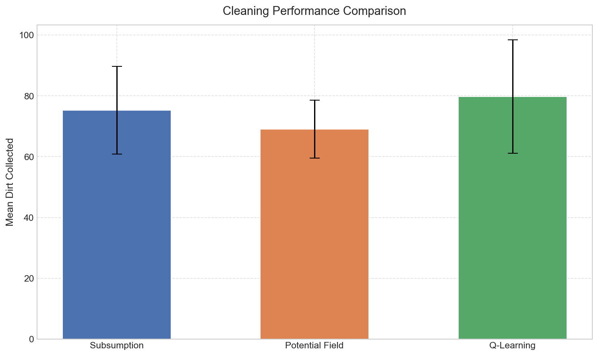
  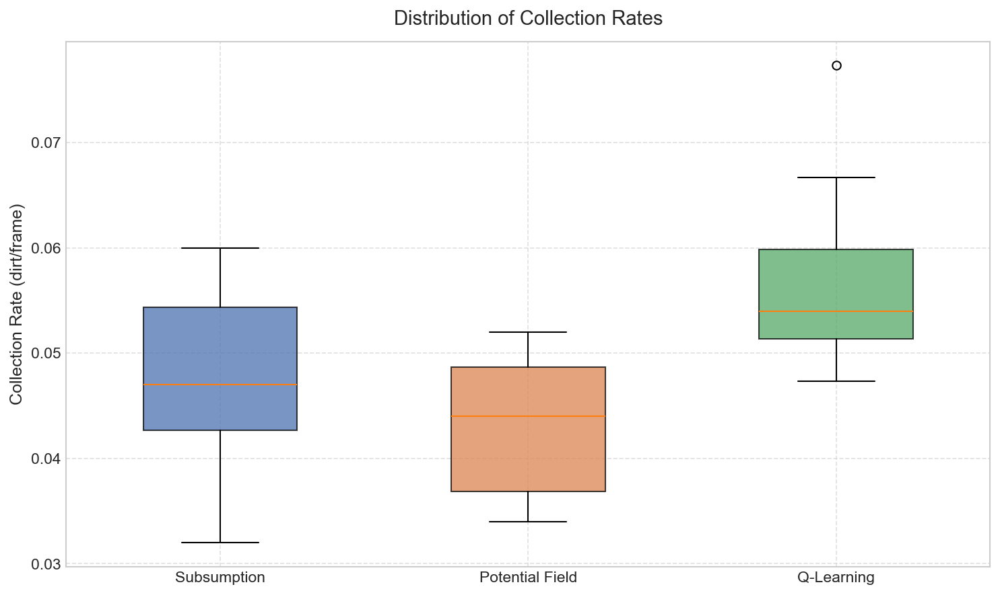
</p>

<p align="center">
  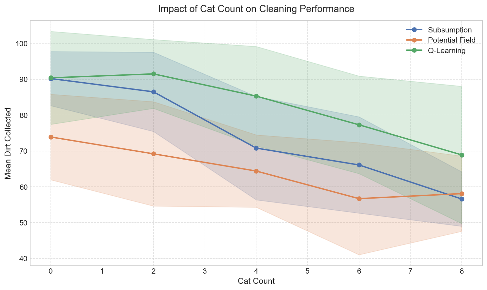
  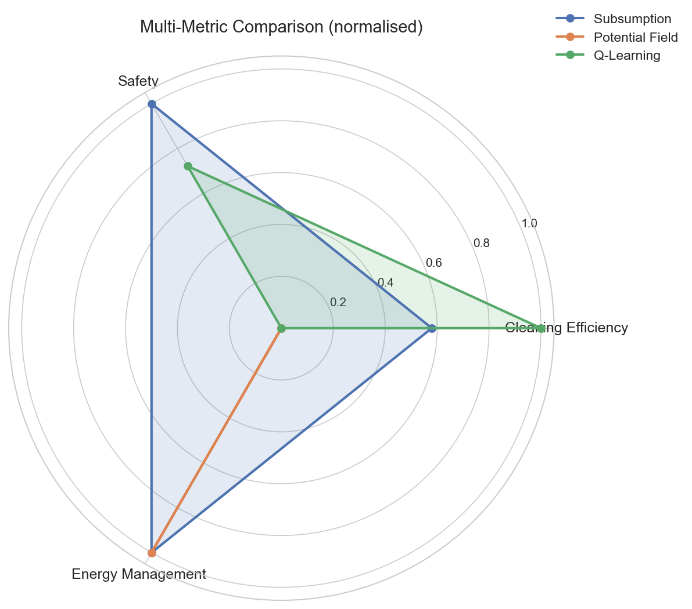
</p>

---

### 研究问题 2：机器人数量的缩放效应
> **问题**：清扫性能如何随机器人数量（1-10）缩放？边际收益递减从何处开始？
>
> **详细报告**：[docs/rq2-report.md](docs/rq2-report.md)

#### 实验设计

- 机器人数量：1, 2, 3, 5, 7, 10
- 3 种大脑 × 6 种数量 × 10 个 seed = **180 次**实验

#### 核心结论

系统呈现明显的**亚线性缩放**。3-5 个机器人是效率最优区间，超过 7 个后安全性和充电站争用显著恶化。

| 机器人数 | Subsumption | APF | Q-Learning | 每机器人效率 (QL) |
|----------|-------------|-----|------------|------------------|
| 1 | 30.8 | 25.6 | **35.8** | 35.8 |
| 3 | 75.3 | 69.1 | **79.8** | 26.6 |
| 5 | 95.7 | 89.5 | **102.2** | 20.4 |
| 10 | 126.6 | 120.5 | **133.6** | 13.4 |

<p align="center">
  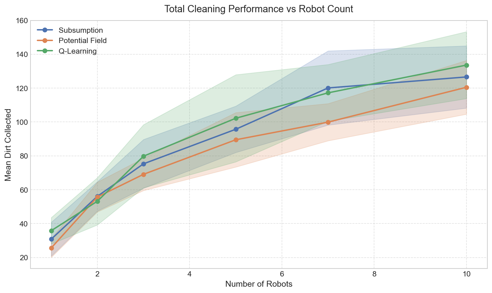
  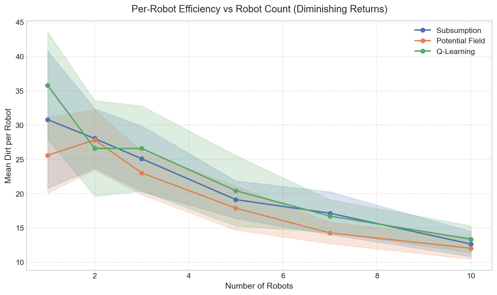
</p>

<p align="center">
  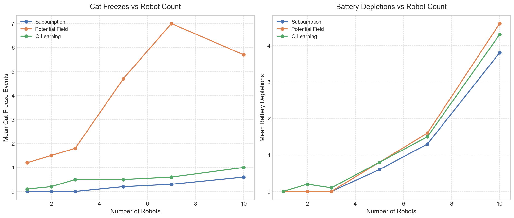
</p>

---

### 研究问题 3：传感器噪声鲁棒性
> **问题**：各架构对传感器噪声的敏感程度如何？哪种架构退化最优雅？
>
> **详细报告**：[docs/rq3-report.md](docs/rq3-report.md)

#### 实验设计

- 噪声模型：乘性高斯噪声 `signal *= max(0, 1 + N(0, σ))`
- 噪声等级 σ：0.0, 0.1, 0.2, 0.3, 0.5, 1.0
- 3 种大脑 × 6 种噪声 × 10 个 seed = **180 次**实验

#### 核心结论

**清扫性能对噪声惊人地稳健**（所有 p > 0.2），但**安全性急剧退化**。人工势场法的猫冻结次数从 1.8 爆增至 36.6（p<0.001），Q-Learning 从 0.5 增至 9.8（p<0.001）。Subsumption 的硬阈值提供了部分保护，仅在 σ=1.0 时显著退化。

| σ | Subsumption 冻结 | APF 冻结 | Q-Learning 冻结 |
|---|-----------------|----------|-----------------|
| 0.0 | 0.0 | 1.8 | 0.5 |
| 0.5 | 1.3 | **15.2** (p<0.001) | **3.3** (p=0.002) |
| 1.0 | **6.4** (p<0.001) | **36.6** (p<0.001) | **9.8** (p<0.001) |

<p align="center">
  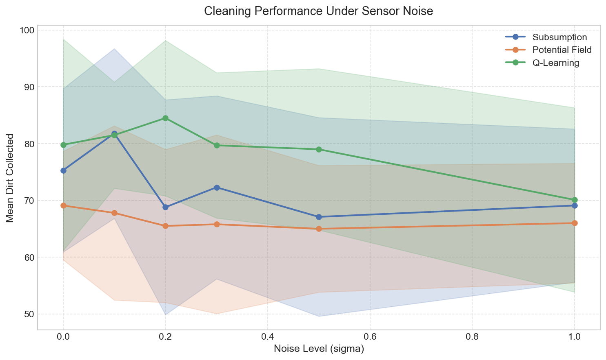
  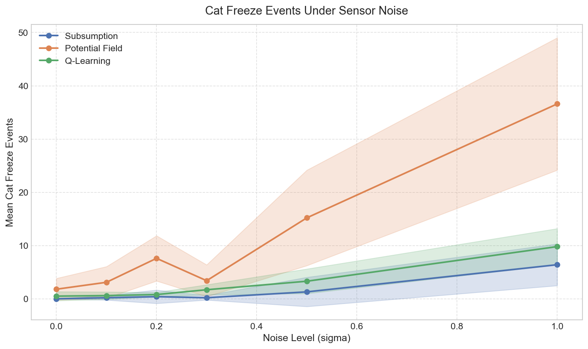
</p>

<p align="center">
  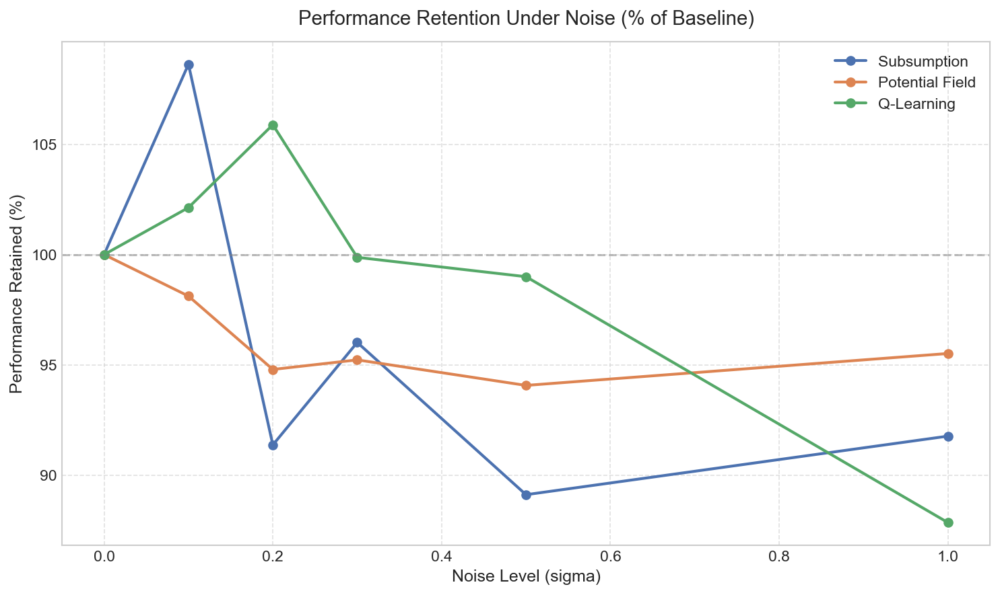
</p>

---

### 研究问题 4：奖励函数设计对 Q-Learning 的影响
> **问题**：不同奖励函数设计如何影响 Q-Learning 的清扫性能、训练稳定性和安全性？
>
> **详细报告**：[docs/rq4-report.md](docs/rq4-report.md)

#### 五种奖励变体

| 变体 | 奖励组成 |
|------|----------|
| **Baseline** | +10/dirt, -0.1/帧, -20/电量耗尽 |
| **Heavy Safety** | Baseline + 接近猫每帧 -5.0, 冻结 -20.0 |
| **Dense Progress** | Baseline + 接近光源 +2.0 |
| **Energy Aware** | Baseline + 充电中 +5.0, 电量<300 每帧 -3.0 |
| **Sparse** | 仅 +10/dirt（无其他惩罚） |

#### 核心结论

**奖励设计能显著影响学习效果，但方向不一定符合直觉。** Energy Aware 由于过度惩罚低电量，性能**灾难性下降**（52.8 vs 79.8，p=0.0007）。Dense Progress 和 Sparse 与 Baseline 持平，说明粗粒度状态空间是性能瓶颈，而非奖励信号。

| 变体 | 平均 Dirt | 猫冻结 | 电量耗尽 |
|------|-----------|--------|----------|
| Subsumption (参考) | 75.3 | 0.0 | 0.0 |
| Baseline | **79.8** | 0.5 | 0.1 |
| Heavy Safety | 78.3 | 0.3 | 0.3 |
| Dense Progress | **80.0** | 0.4 | 0.0 |
| **Energy Aware** | **52.8** | 0.3 | 0.1 |
| Sparse | 79.2 | 0.5 | 0.1 |

<p align="center">
  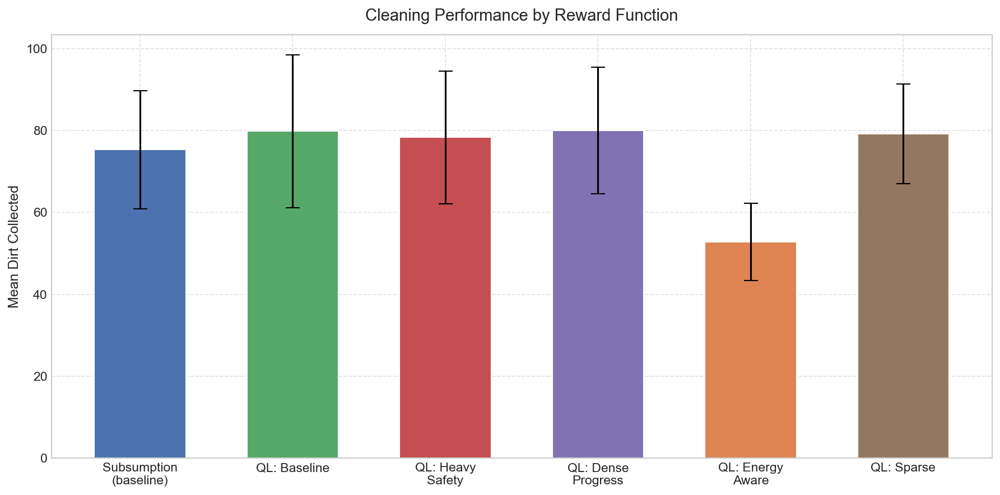
  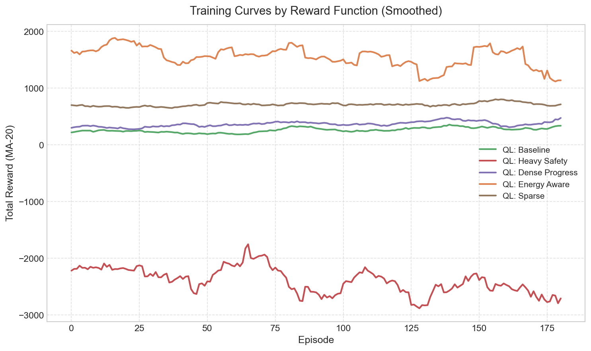
</p>

<p align="center">
  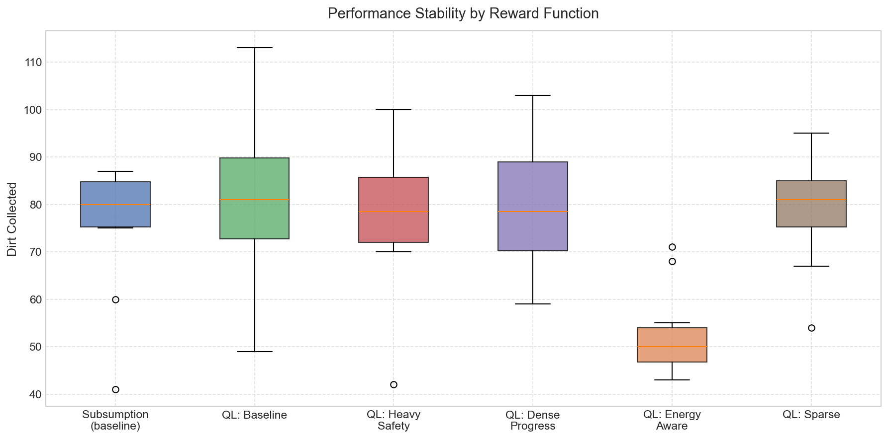
  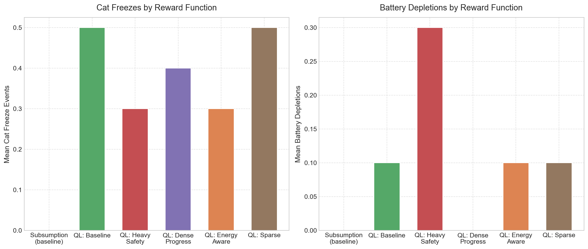
</p>

---

### 研究问题 5：覆盖地图记忆导航
> **问题**：赋予机器人空间记忆（已访问格子地图）能否提升清扫效率？
>
> **详细报告**：[docs/rq5-report.md](docs/rq5-report.md)

#### 实验设计

- 对比：Subsumption（无记忆）vs Coverage（记忆增强）vs Q-Learning
- 运行时长：短（1500 帧）和 长（5000 帧）
- 3 种大脑 × 2 种时长 × 10 个 seed = **60 次**实验
- 额外指标：使用外部网格追踪所有大脑类型的覆盖率

#### 核心结论

覆盖地图记忆**显著损害清扫效率**（短: p=0.041, 长: p<0.001）。更出人意料的是，覆盖大脑的**实际覆盖面积也更低**（24.4% vs Subsumption 的 36.4%），因为确定性的"最近未访问格子"策略形成狭窄路径，而随机漫游+回避行为的随机性反而让机器人分布更广。

| 大脑 | 短期 Dirt | 长期 Dirt | 短期覆盖率 | 长期覆盖率 |
|------|-----------|-----------|-----------|-----------|
| Subsumption | **75.3** | **147.3** | **16.0%** | **36.4%** |
| Coverage | 60.9 | 91.8 | 13.5% | 24.4% |
| Q-Learning | **79.8** | **145.6** | **16.5%** | **36.1%** |

<p align="center">
  
  
</p>

<p align="center">
  
</p>

---

## 实验运行方式

```bash
# ===== RQ1: 三种架构对比 =====
python experiments/train_qlearning.py --episodes 200 --frames 1500
python experiments/run_experiments.py --experiment-type comparison --seeds 10 --frames 1500
python experiments/run_experiments.py --experiment-type cat_gradient --seeds 10 --frames 1500
python experiments/run_experiments.py --experiment-type training_duration --seeds 10 --frames 1500
python experiments/run_generalization.py --seeds 10 --frames 1500 --qtable experiments/qtables/trained.json
python experiments/analyze_results.py --comparison experiments/results/comparison.csv \
  --training experiments/results/training_curve.csv \
  --cat-gradient experiments/results/cat_gradient.csv \
  --training-duration experiments/results/training_duration.csv \
  --qtable experiments/qtables/trained.json --output-dir docs/rq1-figures

# ===== RQ2: 机器人数量缩放 =====
python experiments/run_rq2_scaling.py --seeds 10 --frames 1500
python experiments/analyze_rq2.py --output-dir docs/rq2-figures

# ===== RQ3: 传感器噪声鲁棒性 =====
python experiments/run_rq3_noise.py --seeds 10 --frames 1500
python experiments/analyze_rq3.py --output-dir docs/rq3-figures

# ===== RQ4: 奖励函数设计 =====
python experiments/run_rq4_rewards.py --training-episodes 200 --seeds 10 --frames 1500
python experiments/analyze_rq4.py --output-dir docs/rq4-figures

# ===== RQ5: 覆盖地图记忆 =====
python experiments/run_rq5_coverage.py --seeds 10 --short-frames 1500 --long-frames 5000
python experiments/analyze_rq5.py --output-dir docs/rq5-figures
```

## 作业完成状态

### 已完成

- [x] 仿真环境搭建（2D toroidal 世界，多种实体）
- [x] 自主智能 Agent（多机器人，subsumption 决策架构）
- [x] AI 技术实现（A* 寻路 + subsumption 行为分层 + 反应式避猫）
- [x] 代码模块化重构与 Bug 修复
- [x] 回归测试（79 个）
- [x] Headless 实验模式基础设施
- [x] 结构化日志系统
- [x] **RQ1**：三种 Brain 架构对比（Subsumption / APF / Q-Learning）
- [x] **RQ2**：机器人数量缩放实验（1-10 个机器人）
- [x] **RQ3**：传感器噪声鲁棒性（6 种噪声等级）
- [x] **RQ4**：奖励函数设计对比（5 种奖励变体）
- [x] **RQ5**：覆盖地图记忆导航（新大脑类型）

### 待完成

- [ ] **撰写报告**（4000-8000 字，含文献综述、实验设计、结果分析、反思总结、成员分工）
- [ ] **准备 Presentation**（15 分钟小组演示）
