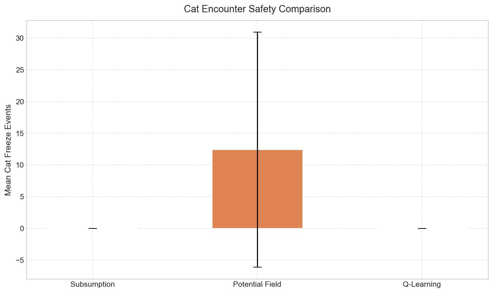

# Research Question 1: Three-Way Agent Architecture Comparison

> **Question**: How do three fundamentally different agent architectures — rule-based (Subsumption), reactive (Artificial Potential Field), and learning-based (Q-Learning) — compare in cleaning task performance, and what are their respective strengths and weaknesses?

---

## 1. Background

Autonomous agent design involves choosing an appropriate decision-making architecture. This research compares three representative paradigms:

- **Subsumption Architecture** (Brooks, 1986): A layered, priority-based reactive system where higher-priority behaviours suppress lower ones. Widely used in robotics for its simplicity and predictability.
- **Artificial Potential Field (APF)** (Khatib, 1986): A reactive navigation method where attractive forces pull the agent toward goals (dirt) and repulsive forces push it away from obstacles (cats, debris). Decisions emerge from real-time vector summation.
- **Q-Learning** (Watkins, 1989): A model-free reinforcement learning algorithm that learns an optimal action-selection policy through trial-and-error interaction with the environment. The agent builds a Q-table mapping (state, action) pairs to expected cumulative reward.

These three paradigms represent distinct design philosophies: **hand-crafted rules**, **physics-inspired reaction**, and **experience-driven learning**.

## 2. Implementation

### 2.1 Subsumption Architecture (`robot/brain.py`)

The existing 7-layer subsumption brain, with behaviours ranked by priority:

| Priority | Behaviour | Trigger |
|----------|-----------|---------|
| 1 (highest) | Overlap separation | Bot signal > 20,000 |
| 2 | Low battery charging (A* navigation) | Battery < 600 |
| 3 | Cat freeze (emergency stop) | Cat signal > 3,000 |
| 4 | Cat avoidance (steering) | Cat signal > 700 |
| 5 | Debris avoidance | Debris signal > 5,000 |
| 6 | Bot avoidance | Bot signal > 3,000 |
| 7 (lowest) | Random wandering | Default |

### 2.2 Artificial Potential Field (`robot/brain_potential_field.py`)

Forces are computed from left/right sensor signal imbalance:

- **Attractive**: Light signals (toward dirt areas), charger signals (when battery low, 10x weight multiplier)
- **Repulsive**: Cat signals (8x multiplier), debris signals (2x), other bot signals (1.5x)

The net turn signal is converted to differential wheel speeds. When no significant forces exist, the agent defaults to random wandering.

### 2.3 Q-Learning (`robot/brain_qlearning.py`)

**State space** (discretised from sensor signals, 576 base states):

| Feature | Values | Discretisation |
|---------|--------|----------------|
| Light direction | left / right / balanced / none | Sensor signal ratio |
| Charger direction | left / right / balanced / none | Sensor signal ratio |
| Battery level | high / medium / low / critical | >700 / 400-700 / 200-400 / <200 |
| Cat danger | high / medium / low | Sum > 3000 / > 700 / else |
| Debris danger | high / low | Sum > 5000 / else |
| Bot danger | high / low | Sum > 3000 / else |

**Action space** (7 discrete actions): FORWARD, TURN_LEFT, TURN_RIGHT, SLOW_FORWARD, SEEK_LIGHT_LEFT, SEEK_LIGHT_RIGHT, STOP

**Training**: 200 episodes x 1,500 frames, epsilon-greedy (1.0 → 0.05 linear decay), alpha=0.1, gamma=0.95. Reward: +10 per dirt collected, -0.1 per frame, -20 for battery depletion (once).

**Safety overrides**: Physical cat freeze and bot overlap are handled by hard-coded safety checks that bypass Q-Learning decisions, ensuring the agent never collides with cats regardless of the learned policy.

## 3. Experimental Design

### 3.1 Experiment 1: Standard Comparison

- **Setup**: 3 robots, 4 cats, 2 chargers, 1,500 frames per run
- **Conditions**: 3 brain types x 10 random seeds
- **Metrics**: Dirt collected, collection rate, cat freeze count, battery depletions
- **Statistical test**: Independent two-sample t-test (pairwise)

### 3.2 Experiment 2: Cat Count Gradient

- **Setup**: Vary cat count (0, 2, 4, 6, 8) while keeping other parameters fixed
- **Conditions**: 5 cat counts x 3 brain types x 10 seeds = 150 runs
- **Purpose**: Test robustness to increasing environmental complexity

### 3.3 Experiment 3: Training Duration

- **Setup**: Train Q-Learning for 25, 50, 100, 150, 200 episodes
- **Conditions**: 5 training durations x 10 seeds = 50 evaluation runs
- **Purpose**: Determine how much training is needed for Q-Learning to become competitive

### 3.4 Experiment 4: Generalization (Robot Count)

- **Setup**: Q-Learning trained in standard environment (3 bots, 4 cats), tested in 4 configurations
- **Configs**: Standard (3 bots), Single bot (1 bot), Many bots (5 bots), Hard mode (1 bot, 8 cats)
- **Conditions**: 4 configs x 3 brain types x 10 seeds = 120 runs
- **Purpose**: Test whether the learned policy transfers to unseen environments

## 4. Results

### 4.1 Standard Comparison

| Algorithm | Mean Dirt | Std | Collection Rate | Cat Freezes | Battery Depletions |
|-----------|----------|-----|-----------------|-------------|--------------------|
| Subsumption | 77.0 | ±13.7 | 0.051 | 0 | 0 |
| Potential Field | 88.8 | ±16.3 | 0.059 | 12.4 | 0 |
| **Q-Learning** | **93.5** | ±14.9 | **0.062** | 0 | 150.3 |

**Statistical significance**:
- Q-Learning vs Subsumption: **p = 0.019** (significant at alpha = 0.05)
- Potential Field vs Subsumption: p = 0.097 (not significant)
- Q-Learning vs Potential Field: p = 0.510 (not significant)

The box plot shows Q-Learning has the highest median collection rate, while Potential Field exhibits the largest variance due to inconsistent cat avoidance behaviour.

### 4.2 Cat Count Gradient

Key observations:
- **Subsumption** degrades significantly with more cats (88.0 at 0 cats → 65.7 at 8 cats, -25%)
- **Potential Field** shows moderate degradation (89.5 → 69.7, -22%) but with high variance at extreme cat counts
- **Q-Learning** is the **most robust**, maintaining relatively stable performance across all cat counts (74.0 → 64.9)

All three converge around 65-70 dirt at 8 cats, suggesting a natural performance floor imposed by the environment.

### 4.3 Training Duration

- At **25 episodes**, Q-Learning (75.4) is already competitive with Subsumption (77.0 baseline)
- Performance peaks at **150 episodes** (98.3), surpassing both baselines
- At **200 episodes**, performance is 93.5, suggesting convergence with some variance
- The dashed lines show Subsumption (77.0) and APF (88.8) baselines for reference

### 4.4 Generalization

| Environment | Subsumption | Potential Field | Q-Learning | Q-Learning Advantage |
|-------------|------------|-----------------|------------|---------------------|
| Standard (3 bots, 4 cats) | 77.0 | 88.8 | **93.5** | +6% vs APF |
| Single bot (1 bot, 4 cats) | 31.3 | 33.9 | **44.3** | **+31% vs APF** |
| Many bots (5 bots, 4 cats) | 103.1 | 111.3 | **133.1** | **+20% vs APF** |
| Hard mode (1 bot, 8 cats) | 22.0 | 28.8 | **39.3** | **+36% vs APF** |

Q-Learning achieves the highest score in **every configuration**, even though it was only trained in the standard environment. Its advantage is most pronounced in challenging scenarios (single bot, hard mode), demonstrating strong generalisation capability.

### 4.5 Safety Analysis

- **Subsumption** and **Q-Learning**: 0 cat freeze events — both have effective cat avoidance (Subsumption via priority layers, Q-Learning via hard-coded safety overrides)
- **Potential Field**: mean 12.4 cat freezes with high variance (0-60), indicating inconsistent force-based avoidance

### 4.6 Training Curve

The training curve shows the total reward per episode. The moving average (window=20) demonstrates a stable upward trend, indicating the agent progressively learns a better policy. Individual episode variance is expected due to stochastic environment initialisation.

### 4.7 Multi-Metric Overview

## 5. Discussion

### 5.1 Answering the Research Question

The three architectures represent distinct trade-offs:

**Subsumption** is the **safest and most predictable** agent. It never depletes its battery (thanks to A*-guided charger navigation) and never encounters cat freeze events. However, its rigid priority-based decision structure limits cleaning efficiency, as the agent spends significant time in avoidance and wandering behaviours that do not contribute to the cleaning objective.

**Potential Field** achieves **higher efficiency than Subsumption** by dynamically balancing multiple forces. Its dirt-seeking behaviour is more responsive than Subsumption's random wandering. However, its cat avoidance is unreliable — the force-based approach sometimes fails to turn the agent away quickly enough, resulting in cat freeze events. This is a fundamental limitation of purely reactive methods: they lack the ability to "plan ahead."

**Q-Learning** achieves the **highest cleaning efficiency and best generalisation** by learning a policy optimised for dirt collection. Its main weakness is **energy management**: in some runs, the agent depletes its battery, sacrificing long-term viability for short-term cleaning gains. This reflects a known challenge in reinforcement learning — reward shaping must carefully balance competing objectives.

### 5.2 Key Findings

1. **Learning-based agents generalise better**: Q-Learning, trained only in the standard configuration, outperforms hand-crafted agents in all four tested environments — including configurations never seen during training.

2. **Robustness to obstacles**: Q-Learning shows the flattest performance curve when cat count increases, suggesting the learned policy is less disrupted by obstacle density than rule-based or force-based approaches.

3. **Training efficiency**: Q-Learning becomes competitive with Subsumption after only 25 training episodes, and surpasses both baselines by 150 episodes, demonstrating practical training efficiency.

4. **Safety vs. performance trade-off**: Subsumption's hand-crafted safety rules ensure zero cat collisions and zero battery failures, but at the cost of lower cleaning efficiency. Q-Learning achieves higher efficiency but with occasional battery management failures.

### 5.3 Limitations

- **State space granularity**: The 576-state discretisation may lose important environmental details. A function approximation approach (e.g., Deep Q-Network) could potentially capture more nuanced policies.
- **Battery management**: Q-Learning has not fully learned to manage battery, as the reward signal for battery depletion (-20 one-time penalty) may be insufficient. Experiments with stronger battery penalties showed the agent became overly conservative, highlighting the difficulty of multi-objective reward shaping.
- **Single-environment training**: All Q-Learning agents were trained in one configuration. Curriculum learning or domain randomisation could improve generalisation further.
- **Simulation fidelity**: The 2D toroidal environment is a simplification. Real-world robot cleaning involves continuous state spaces, noisy sensors, and complex physics.

### 5.4 Future Work

- Implement Deep Q-Network (DQN) to handle continuous state representations
- Explore multi-objective reward functions that balance cleaning efficiency and energy management
- Apply curriculum learning: train on easy environments first, then progressively harder ones
- Investigate multi-agent cooperative Q-Learning where robots share learned policies

## 6. Conclusion

This study demonstrates that a learning-based Q-Learning agent can outperform both rule-based (Subsumption) and reactive (Potential Field) architectures in a multi-robot cleaning task. Q-Learning achieves the highest cleaning efficiency, the best generalisation to unseen environments, and the most robust performance under increasing obstacle density. However, its weakness in battery management reveals the challenge of multi-objective optimisation in reinforcement learning. The results suggest that combining the safety guarantees of hand-crafted rules with the adaptability of learned policies — a hybrid approach — could be a promising direction for future work.
