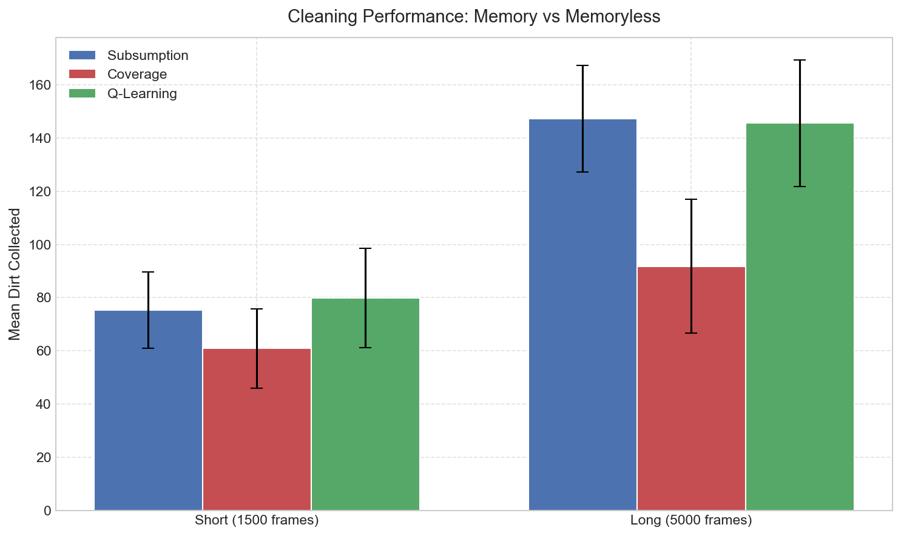
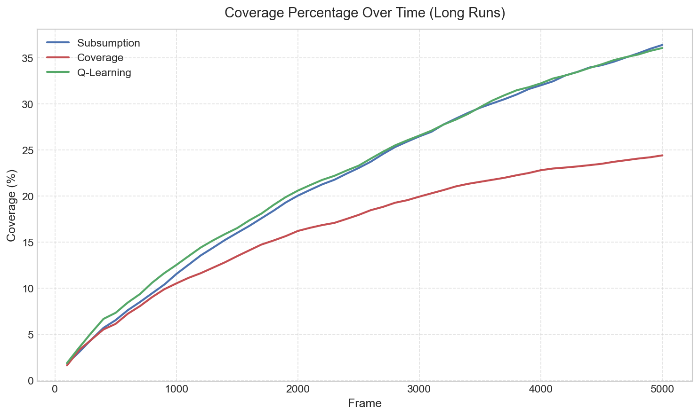
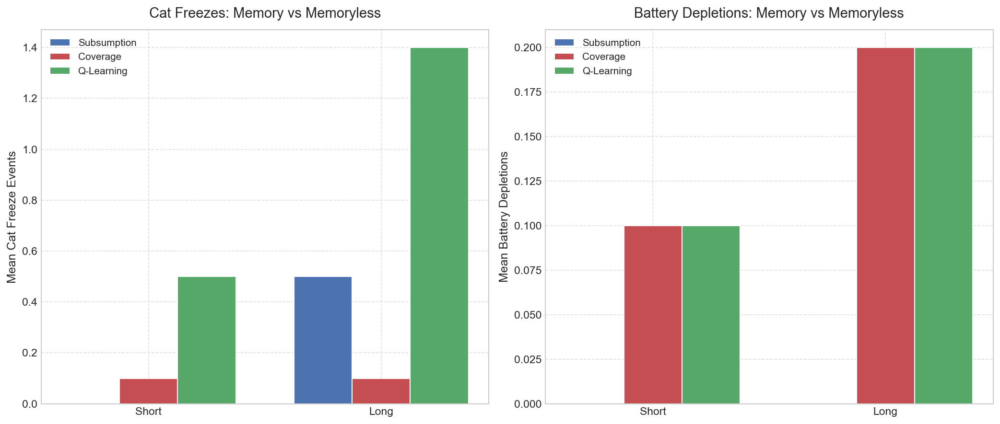

# Research Question 5: Memory-Augmented Navigation

> **Question**: Does giving the robot spatial memory (a visited-cell coverage map) improve cleaning efficiency over memoryless reactive control?

---

## 1. Background

The default Subsumption controller uses random wandering as its lowest-priority behavior, with no memory of where it has been. This means robots frequently revisit already-cleaned areas. This study implements a **Coverage Map Brain** that extends the Subsumption architecture with a 50x50 grid of visit counts. When no higher-priority behavior is active, the robot steers toward the nearest least-visited cell instead of wandering randomly.

### 1.1 Coverage Brain Design

The `CoverageMapBrain` (`robot/brain_coverage.py`) uses the same 7-layer Subsumption priority stack for safety behaviors. Only the default (lowest-priority) behavior changes:

1. Discretize the 1000x1000 world into a 50x50 grid (20px cells)
2. Each frame, increment the visit counter for the bot's current cell
3. When choosing a movement direction, find the nearest cell with the minimum visit count
4. Use proportional steering to navigate toward that cell

## 2. Experimental Design

- **Brain types**: Subsumption (memoryless), Coverage (memory-augmented), Q-Learning
- **Run durations**: Short (1500 frames) and Long (5000 frames)
- **Configuration**: 3 robots, 4 cats, 2 chargers
- **Repetitions**: 10 random seeds per condition
- **Total runs**: 3 x 2 x 10 = 60
- **Additional metric**: coverage percentage (fraction of grid cells visited at least once)

## 3. Results

### 3.1 Cleaning Performance

| Brain | Short (1500f) | Long (5000f) |
|-------|---------------|--------------|
| Subsumption | **75.3** | **147.3** |
| Coverage | 60.9 | 91.8 |
| Q-Learning | **79.8** | **145.6** |

The coverage brain collects **significantly less dirt** than both Subsumption and Q-Learning. The gap is statistically significant in both short runs (p=0.041) and long runs (p<0.001). The deficit widens in longer runs (19% drop short, 38% drop long), indicating that the coverage steering actively diverts robots from productive cleaning areas.

### 3.2 Coverage Over Time

With external position-tracking applied to all brain types:

| Brain | Short Coverage | Long Coverage |
|-------|---------------|---------------|
| Subsumption | **16.0%** | **36.4%** |
| Coverage | 13.5% | 24.4% |
| Q-Learning | **16.5%** | **36.1%** |

Counterintuitively, the coverage brain achieves **less** area coverage than random Subsumption (24.4% vs 36.4% in long runs). This is because the coverage brain's deterministic steering toward specific target cells creates narrow, repeated paths, while random wandering combined with cat/bot avoidance naturally scatters robots more broadly across the space.

### 3.3 Safety

| Brain | Short Freezes | Long Freezes | Short Batt. Depl. | Long Batt. Depl. |
|-------|--------------|--------------|-------------------|------------------|
| Subsumption | 0.0 | 0.5 | 0.0 | 0.0 |
| Coverage | 0.1 | 0.1 | 0.1 | 0.2 |
| Q-Learning | 0.5 | 1.4 | 0.1 | 0.2 |

The Coverage brain maintains **excellent safety** — comparable to Subsumption — because it inherits the same priority-based safety stack. The slight increase in battery depletions (0.1-0.2) is due to the coverage steering sometimes navigating robots away from chargers.

## 4. Discussion

### 4.1 Why Coverage Doesn't Help Cleaning

The key insight is that **uniform coverage is not the same as efficient cleaning**:

1. **Random wandering produces better spatial spread**: the Subsumption brain's default behavior is purely random walk/turn, with no light-following. Combined with cat avoidance, bot avoidance, and debris avoidance (which inject frequent direction changes), random wandering produces diverse trajectories that scatter robots broadly across the world.
2. **Deterministic steering reduces effective coverage**: the coverage brain's greedy "nearest unvisited cell" heuristic creates narrow, repeated paths. In contrast, random wandering produces more diverse trajectories that spread robots across the space.
3. **No per-cell dirt knowledge**: the coverage map tracks visits, not dirt locations. A more intelligent system would track where dirt was found and prioritize those areas.
4. **Coverage brain achieves less area coverage despite trying**: Subsumption covers 36.4% of the grid in long runs vs Coverage brain's 24.4%, showing that systematic exploration is inferior to stochastic spread in this environment.

### 4.2 When Coverage Would Help

Coverage-guided navigation would likely outperform random wandering in scenarios where:
- Dirt is distributed uniformly rather than clustered near lamps
- Run duration is much longer (10,000+ frames)
- The world is smaller or the grid is coarser
- The coverage map incorporates dirt-finding memory, not just visit counts

### 4.3 Key Findings

1. **Spatial memory actively hurts cleaning efficiency** in this environment — the coverage steering pulls robots away from lamp areas where dirt concentrates, causing a statistically significant 19-38% performance drop.
2. **Coverage brain paradoxically covers LESS area** than random wandering (24.4% vs 36.4% in long runs). Deterministic nearest-cell targeting creates narrow paths, while stochastic wandering with avoidance behaviors scatters robots more broadly.
3. **Coverage maintains safety parity** with Subsumption, confirming the safety stack is properly inherited.
4. **Random wandering is a surprisingly strong baseline** when combined with reactive light-following, because it naturally concentrates effort near dirt sources and achieves better spatial spread.
5. **The performance gap widens with run length**: in long runs, the coverage brain misses 38% of what Subsumption collects, showing that sustained exploration of empty areas compounds the cleaning deficit.

### 4.4 Limitations

- Only one coverage strategy tested (nearest least-visited cell). Frontier-based exploration or A*-guided coverage could perform differently.
- Coverage map is per-robot with no sharing; a shared map could improve team efficiency.
- The coverage grid resolution (20px) may be too fine for the bot's movement speed.

## 5. Conclusion

Adding spatial memory through a coverage map **significantly hurts** cleaning performance in this environment (p<0.05 in both short and long runs) because dirt is concentrated near lamps, not uniformly distributed. The coverage steering actively pulls robots into low-dirt areas, producing a 19-38% cleaning deficit compared to memoryless Subsumption. Random wandering combined with reactive light-following proves to be a surprisingly effective strategy because it naturally concentrates effort near dirt sources. However, the coverage brain successfully maintains the same safety guarantees as Subsumption, proving that the memory-guided exploration layer integrates cleanly with the priority-based safety architecture. Future work should explore **dirt-aware memory** (remembering where dirt was found) rather than pure area coverage, or hybrid approaches that only explore when no lamp signal is detected.
